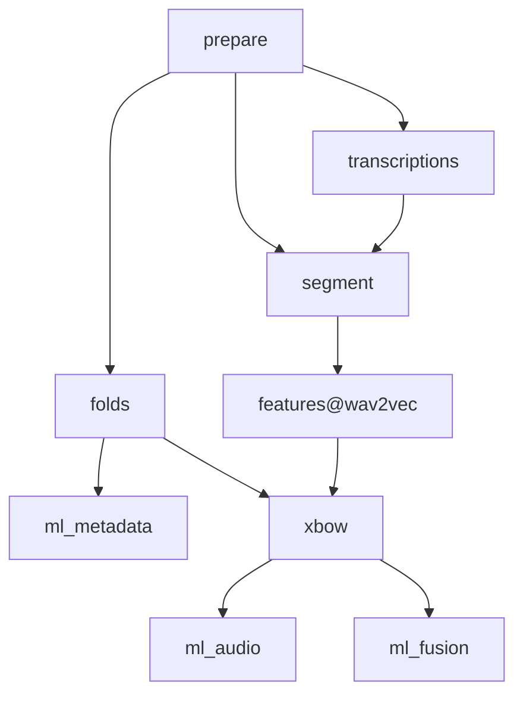

# Machine Learning Based Assessment of MDD from Paralinguistic Speech Characteristics in Routine Care
This repository contains the code for the machine learning experiments conducted in the paper submission "Validation of Machine-Learning-Based Assessment of Major Depressive Disorder from Paralinguistic Speech Characteristics in Routine Care".

## Installation of dependencies
First, clone the repository WITH the openXBOW submodule:
```
git clone --recurse-submodules https://github.com/mauricege/MMD-from-PSC.git
```

### With nix
If you have nix with flakes support installed (e.g., using [this installer](https://github.com/DeterminateSystems/nix-installer)) you can run 
```
nix develop path:.env/ --impure
``` 
to enter an environment where all dependencies are installed. It's even easier using direnv: just run 
```
direnv allow
```
and the environment will be activated automatically on entering the repository's root.

### Without nix
You need to install a compatible python version (`>=3.9,<4`), poetry and java. Then run 
```
poetry install
``` 
to install all python dependencies and 
```
poetry shell
``` 
to enter the environment.


## ML Pipeline overview
The below flowchart shows how the individual steps of the machine learning pipeline are connected. For details on the individual stages, check [dvc.yaml](dvc.yaml).
